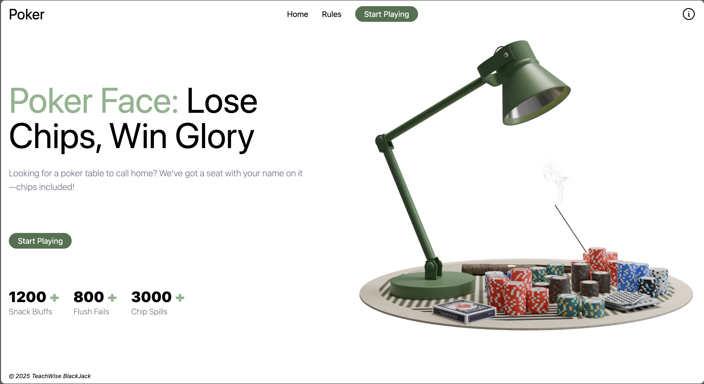
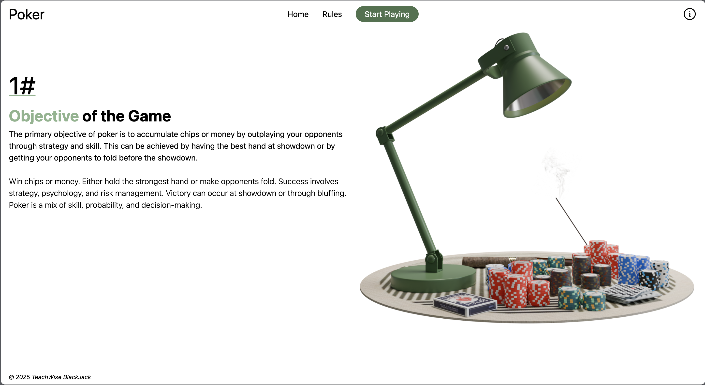
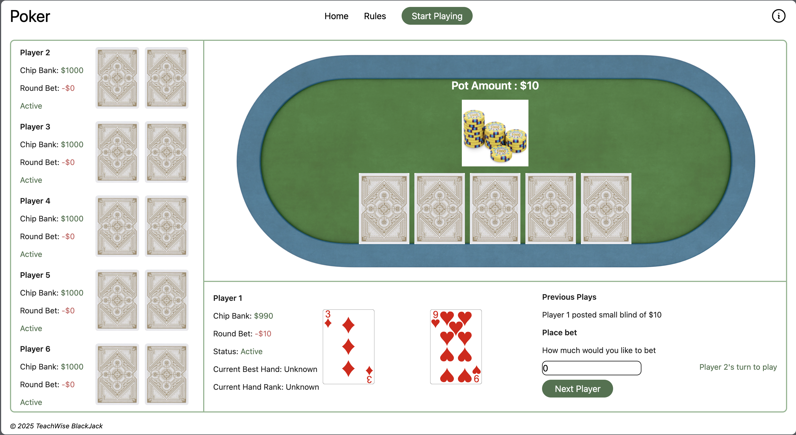

# ♠️ Poker Game

A simple poker game with a **React frontend** and **Node.js/Express backend**, allowing players to simulate a poker table experience with AI players .

---

## 📋 Table of Contents

- [♠️ Poker Game](#️-poker-game)
  - [📋 Table of Contents](#-table-of-contents)
  - [🚀 Features](#-features)
  - [🛠️ Tech Stack](#️-tech-stack)
  - [📁 Project Structure](#-project-structure)
  - [⚙️ Setup \& Installation](#️-setup--installation)
    - [1️⃣ Clone the repository](#1️⃣-clone-the-repository)
    - [2️⃣ Setup the Backend](#2️⃣-setup-the-backend)
    - [3️⃣ Setup the Frontend](#3️⃣-setup-the-frontend)
    - [4️⃣ Environment Variables](#4️⃣-environment-variables)
  - [🕹️ Usage](#️-usage)
  - [🛣️ API Endpoints](#️-api-endpoints)
  - [🃏 Game Rules](#-game-rules)
  - [📸 Screenshots](#-screenshots)
  - [🤝 Contributing](#-contributing)
  - [🪪 License](#-license)
  - [🚀 Future Improvements](#-future-improvements)

---

## 🚀 Features

- Singleplayer Texas Hold’em style gameplay.
- Responsive **React frontend** with Tailwind CSS.
- **Express.js backend** with clear REST API endpoints.
- Game state management and round control.
- AI players to simulate gameplay .
- Separation of concerns between frontend and backend for easy scalability.

---

## 🛠️ Tech Stack

- **Frontend:** React, Tailwind CSS, Vite/CRA
- **Backend:** Node.js, Express, Mongo DB
- **State Management:** React Hooks
- **Communication:** REST API
- **Styling:** Tailwind CSS & Ant Design

---

## 📁 Project Structure

```
/poker-game
  /frontend
    src/
        assets/
        components/
        pages/
            pagesSubSections
        utils/
    public/
    package.json
    .env
  /backend
    controllers/
    data/
    models/
    routes/
    services/
    utils/
    .env
    server.js
    package.json
README.md
```

---

## ⚙️ Setup & Installation

### 1️⃣ Clone the repository

```bash
git clone https://github.com/yourusername/poker-game.git
cd poker-game
```

### 2️⃣ Setup the Backend

```bash
cd Poker_Backend
npm install
npm run dev
```

The backend server will run on `http://localhost:5001` by default.

### 3️⃣ Setup the Frontend

Open a new terminal:

```bash
cd Poker_Frontend
npm install
npm run dev
```

The frontend will run on `http://localhost:5173` by default.

### 4️⃣ Environment Variables

Create a `.env` file in `/Poker_Frontend`:

```env
VITE_API_BASE_URL=http://localhost:5001/api
```

---

Create a `.env` file in `/Poker_Backend`:

```env
MONGO_URI=mongodb://localhost:27017/pokerGameDB
PORT=5001
```

---

## 🕹️ Usage

- Navigate to `http://localhost:5173` in your browser.
- Start a new game or continue an existing game.
- Perform actions such as **Check**, **Bet**, **Fold**, and **Raise**.
- AI players will simulate opponents during gameplay.

---

## 🛣️ API Endpoints

| Method | Endpoint                 | Description              |
| ------ | ------------------------ | ------------------------ |
| GET    | `/api/game/gameState`    | Fetch current game state |
| POST   | `/api/game/playerAction` | Submit player action     |
| GET    | `/api/game/startGame`    | Start a new game         |
| GET    | `/api/game/nextRound`    | Advance to next round    |

**Example Request:**

```json
POST /api/game/playerAction
{
  "action": "bet",
  "amount": 50
}
```

**Example Response:**

```json
{
  "message": "Action received",
  "state": { ... }
}
```

---

## 🃏 Game Rules

- Texas Hold’em structure:

  - Deal → Pre-flop → Flop → Turn → River → Showdown.

- Highest hand wins the pot based on poker hand rankings.
- Each player can check, call, bet, raise, or fold depending on game state.
- AI players automatically perform actions for simulation.

---

## 📸 Screenshots

> Add screenshots or GIFs here:

- **Home View:** 
- **Rule View:** 
- **Table View:** 

_(Replace with your actual screenshots or record a GIF using Loom for demonstration.)_

---

## 🤝 Contributing

Contributions are welcome! To contribute:

1. Fork the repository.
2. Create your feature branch:

   ```bash
   git checkout -b feature/YourFeature
   ```

3. Commit your changes:

   ```bash
   git commit -m "Add your feature"
   ```

4. Push to your branch:

   ```bash
   git push origin feature/YourFeature
   ```

5. Open a pull request.

---

## 🪪 License

This project is licensed under the **© 2025 TeachWise BlackJack**.

---

## 🚀 Future Improvements

- Real-time gameplay using **Socket.io** for live updates.
- Player authentication and persistent user profiles.
- Chip management and leaderboard.
- Mobile touch gesture support for faster gameplay.

---

Feel free to open issues for bugs, feature requests, or improvements. Enjoy your poker game! 🎮
